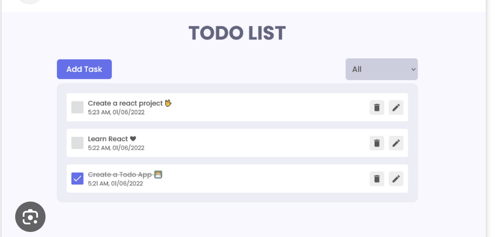

# React Projektplanung

## 1. Kernfunktionen

- Was soll die App können?
- [ ] To Do's erstellen, hinzufügen, ändern und löschen

## 2. Komponenten

### Komponenten-Übersicht

- App
  - AddToDo
  - FilterToDo
  - DisplayAllToDos
    - SingleToDo (mit Checkbox, Löschen und Editieren)
  - Layout (Header)

### Komponenten-Details

- **DisplayAllToDos**:
  - Props: { toDoList }
  - State: [ updateList, setUpdateList ]
  - Funktionen: displayAllToDos()
- **SingleToDo**:
  - Props: { title, isDone, createdAt, category }
  - State: [ isDone, setDone ] ??
  - Funktionen: filter()
- **FilterToDo**:
  - Props: { toDoList }
  - State: [ filterList, filterList ]
  - Funktionen: filter()
- **AddToDo**:
  - Props: { toDoList }
  - Funktionen: addToDo()

## 3. State-Management

### Globaler State (Context/Redux)

- [ ] ToDoListContext: Provided alle Komponenten mir der ToDo Liste

## 4. Datenfluss

- Wie kommunizieren Komponenten miteinander?
  - über einen ToDoManagerService
- Welche Props werden übergeben?
  - ToDoList
- Welche Events werden ausgelöst?
  - onClick z.b. bei AddTask delete update etc...

## 6. Offene Fragen

- wie sieht so ein service todolistmanager aus? ich kenne es aus java, das man eine klasse erstellt und über eine instanz dieser managaer klasse alles verwaltet, ich weiß nur nicht, ob man es so auch in react macht bzw wie es in funktionaler programmierung tut bzw. was genau der moderne best practice ist
